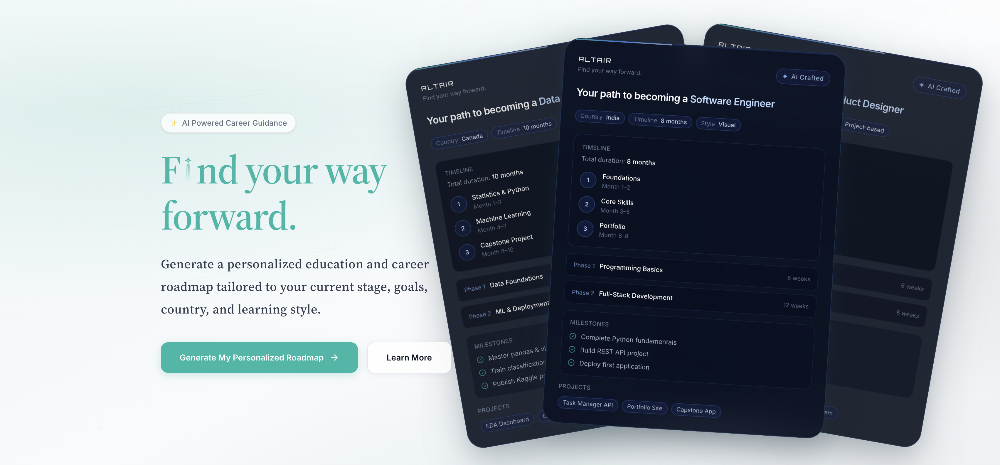

 

 

## About Me

I’m a software developer with nearly **four years of experience** building and maintaining real-world web applications across the frontend and backend. My journey started with the MERN stack, but quickly grew beyond simply building features. I’ve worked on production platforms involving complex user workflows, REST APIs, search, payments, third-party integrations and deployments — learning most from the problems that only appear when software meets real users.

Over time, my role expanded beyond implementation. I became involved in debugging production issues, discussing requirements and edge cases, reviewing code, working directly with clients, and helping interns and junior developers navigate technical problems. Those experiences shaped how I approach engineering today: understand the problem first, think through how the system behaves end-to-end, and then choose the simplest reliable solution rather than reaching immediately for a particular technology.

I’m now extending that software engineering foundation into **Artificial Intelligence**. I’m particularly interested in building AI-powered products where models become one component of a well-engineered system rather than the entire product. **ALTAIR** is my first major step in that direction, combining full-stack engineering with structured AI outputs, validation and responsible product design. I’m continuing to deepen my AI/ML foundations while building software that solves meaningful, practical problems.

 

## Engineering Toolkit

  

  

**Frontend** &nbsp; React · Redux · TypeScript · Tailwind · Responsive UI  
**Backend** &nbsp; Node.js · Express · MongoDB · REST APIs · JWT · RBAC  
**AI Integration** &nbsp; Gemini API · Prompt Design · Structured AI Outputs · Schema Validation  
**Delivery** &nbsp; Git · GitHub · Vercel · Render · Heroku · Postman

Algolia · SendGrid · Zapier · Cronofy · Nylas · Webhooks · Payment Integrations

 

## Featured Project

# ALTAIR

### *Find your way forward.*

AI-powered personalised education & career roadmaps, generated from a learner's **goals, context, preferences and available time**.

 

&nbsp;

  

  

<strong>REACT · TYPESCRIPT · NODE.JS · EXPRESS · GOOGLE GEMINI</strong>

  

 

ALTAIR transforms a learner's goals, current knowledge, preferences and available study time into a structured education and career roadmap.

### How it works

 

**Engineering decisions**

- Structured AI responses instead of uncontrolled free-form output
- Schema validation to keep generated roadmap data predictable
- Clear separation between frontend, backend and AI integration layers
- Human-centred Responsible AI principles: AI supports user decisions rather than replacing them
- Production deployment using Vercel and Render

> ALTAIR is currently being prepared as a polished public engineering case study. Source code remains private for now.

 

## What I Work On

### Product Engineering
Full-stack product features from requirements to production — React interfaces, backend APIs, authentication, RBAC and application workflows.

### Systems & Integrations
Search, payments, webhooks and third-party services, with hands-on debugging across frontend, backend and external systems.

### Artificial Intelligence
Gemini API integration, prompt design, structured outputs and schema validation for practical product features.

 

## Engineering Journey

**2022** — MERN Stack Developer  
Started working on live client applications across frontend, backend and APIs.

**2023** — Associate Software Developer  
Built production features, integrations, authentication, search and business workflows.

**2024** — Software Developer  
Expanded into production ownership, client collaboration, PR reviews, mentoring and deployments.

**2026 →** Software Engineering × AI  
Building ALTAIR and strengthening deeper AI/ML foundations.

 

## Currently

→ Building **ALTAIR** into a strong public engineering case study  
→ Deepening **Artificial Intelligence & Machine Learning** foundations  
→ Building projects where **software engineering and practical AI** genuinely complement each other

 

---

### Engineering is more than making code work.

*I care about understanding why a solution works, how it behaves in production, and how it serves the person using it.*

 

