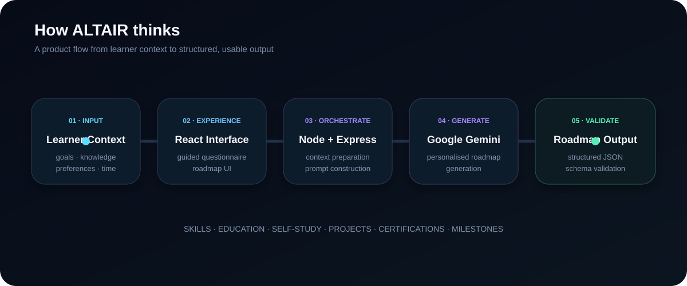

 

 

## About

Software Developer with nearly **4 years of professional experience** building and shipping full-stack web applications. I work across frontend, backend, APIs, search, authentication, third-party integrations, deployments and production debugging.

I'm now extending that software-engineering foundation into **AI-powered products**, with an emphasis on building useful systems rather than adding AI for the sake of it.

 

## Engineering Toolkit

  

  

**Frontend** &nbsp; React · Redux · TypeScript · Tailwind · Responsive UI  
**Backend** &nbsp; Node.js · Express · MongoDB · REST APIs · JWT · RBAC  
**AI Integration** &nbsp; Gemini API · Prompt Design · Structured AI Outputs · Schema Validation  
**Delivery** &nbsp; Git · GitHub · Vercel · Render · Heroku · Postman

Algolia · SendGrid · Zapier · Cronofy · Nylas · Webhooks · Payment Integrations

 

## Featured Project

# ALTAIR
### *Find your way forward.*

**AI-powered personalised education & career roadmap platform**

`React` &nbsp; `TypeScript` &nbsp; `Node.js` &nbsp; `Express` &nbsp; `Google Gemini`

 

ALTAIR transforms a learner's goals, current knowledge, preferences and available study time into a structured education and career roadmap.

### How it works

 

**Engineering decisions**

- Structured AI responses instead of uncontrolled free-form output
- Schema validation to keep generated roadmap data predictable
- Clear separation between frontend, backend and AI integration layers
- Human-centred Responsible AI principles: AI supports user decisions rather than replacing them
- Production deployment using Vercel and Render

> ALTAIR is currently being prepared as a polished public engineering case study. Source code remains private for now.

 

## What I Work On

### Product Engineering
Full-stack product features from requirements to production — React interfaces, backend APIs, authentication, RBAC and application workflows.

### Systems & Integrations
Search, payments, webhooks and third-party services, with hands-on debugging across frontend, backend and external systems.

### Applied AI
Gemini API integration, prompt design, structured outputs and schema validation for practical product features.

 

## Engineering Journey

**2022** — MERN Stack Developer  
Started working on live client applications across frontend, backend and APIs.

**2023** — Associate Software Developer  
Built production features, integrations, authentication, search and business workflows.

**2024** — Software Developer  
Expanded into production ownership, client collaboration, PR reviews, mentoring and deployments.

**2026 →** Software Engineering × AI  
Building ALTAIR and strengthening deeper AI/ML foundations.

 

## Currently

→ Building **ALTAIR** into a strong public engineering case study  
→ Deepening **Artificial Intelligence & Machine Learning** foundations  
→ Building projects where **software engineering and practical AI** genuinely complement each other

 

---

### Engineering is more than making code work.

*I care about understanding why a solution works, how it behaves in production, and how it serves the person using it.*

 

